<h1 align="center">agy-background-agent</h1>

  A background supervisor for Antigravity coding agents. 
  Tracks execution steps, prevents premature completion, and flags drift.

  
  
  
  

---

Fast agents fail when they enter repetitive error loops, drift from task requirements, or stop early on mock tests. This repository provides Antigravity hooks that run beside the worker agent to catch these failures.

  

## Benchmark: sage ON/OFF on DeepSWE-style long-horizon tasks

This pilot benchmark measures whether the background supervisor helps a fast-tier agy worker on a long-horizon coding task. The evaluation runs on `kysely-window-grouping-helpers` from the DeepSWE-style task suite, containing 254 fail-to-pass and 22 pass-to-pass tests. Graders check byte-exact SQL compilation across PostgreSQL, MySQL, MSSQL, and SQLite using CTRF canonical node matching.

The test worker runs Gemini 3.7 Flash inside isolated worktrees. Setting `AGY_SAGE_DISABLED=1` via `--sage-off` unplugs the background supervisor per spawn without mutating shared configuration files.

  

### Findings

- Every run that included byte-exact verification requirements in the brief reached a 1.0 reward across both supervisor states (arm3, r2a, r2b, r2c).
- The arm4 run failed the binary threshold (0.0 reward) due to a single stray space in SQL syntax across 4 dialect tests, despite passing 250 of 254 assertions (98.4% pass fraction).
- Turn counts fall within a narrow band of 141 to 201 steps across all runs. Initial observations of turn count reductions were trace artifacts from session mapping, corrected by pairing workers to brain transcripts via brief paths.

Methodology review and harness architecture details are documented in [REVIEW-opus5.md](benchmark/deepswe-sage-ab/REVIEW-opus5.md).
